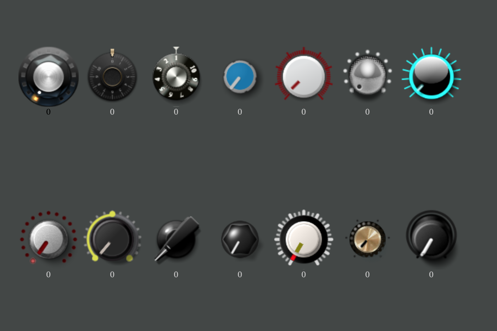
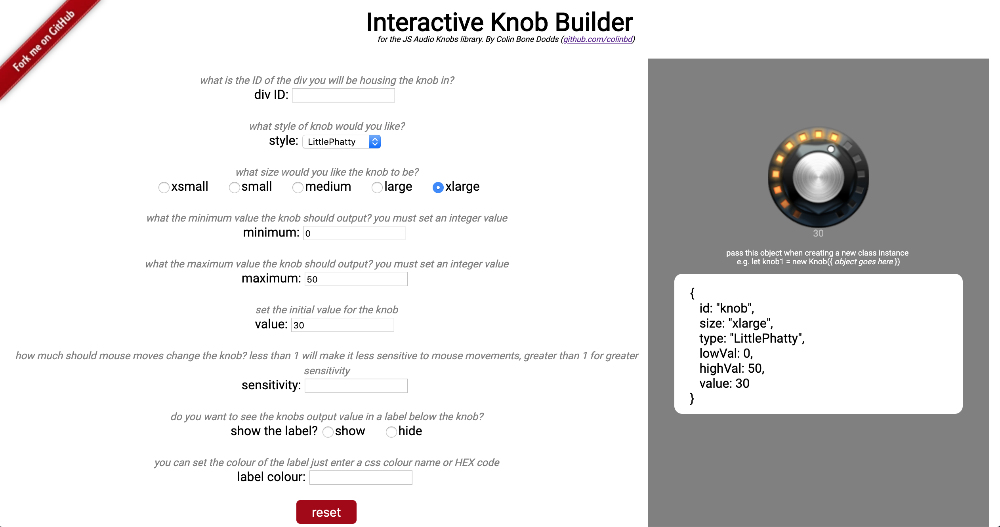

# JSAudioKnobs

Add audio knobs (dials) to your web app. Ideal for web audio API based projects

<p align="center">
   
</p>

## Getting started

1. Place the following link at the bottom of the _head_ section of your html file
   `<script src="https://colinbd.github.io/JSAudioKnobs/knobs.js"></script>`
2. Within the body of your html create a div where you want a knob to reside and give it the class of 'knob' and a unique ID
   `<div class="knob" id="knob1"></div>`
3. Within your main script (which must be below the knobs.js script) create a knob by calling new Knob and passing in the ID of the div you want to place the knob in
   `let dial1 = new Knob({id: "knob1"});`
4. A knob should be visible on your page, configured with the defaults
5. You can pass in more parameters when making an instance of the class to configure the knob to your requirements - [use the interactive knob builder to design your knob, then just copy the object which is output](https://colinbd.github.io/JSAudioKnobs)
6. You can get the value of a knob using `dial1.getValue()`
7. You set the value of a knob like `dial1.setValue(20)`
8. You can hook into the knob change event by placing the following function in your script

```javascript
function knobChanged(id, val) {
  //console.log(`knob with ID: ${id} change to ${val}`);
}
```

## Building a knob

As mentioned above, the easiest way to design your knob is with the [Interactive Knob Builder](https://colinbd.github.io/JSAudioKnobs). Just copy the object code which is generated on screen and pass it in when creating a Knob class instance.

<p align="center">
   
</p>

Or if you want to just do it yourself, you can set the following parameters to override the defaults:

```javascript
{
  (id = "knob1"), // the ID of the div you want the knob to live in
    (lowVal = 0), // the minimum value the knob goes to - set this to whatever you like
    (highVal = 100), // the maximum value the knob goes to - again, set this to whatever you like
    (value = 0), // the initial value
    (size = "medium"), // choices: xsmall, small, medium, large, xlarge
    (sensitivity = 1), // try 0.5 to make the knob less sensitive to mouse movements, 1.5 for bigger knob changes relative to mouse moves
    (type = "LittlePhatty"), //alternatives: Vintage, FStyle, SSLish, RedScale, Silver, Aqua, kjLED, Credence, Wedge, Hexagonal, Hippy, Bluesbreaker, Oscar
    (label = true), // or false. Do you want to see a numeric readout of the value below the knob?
    (lblTxtColor = "silver"); // or "#C0C0C0" or any other css colour you like
}
```

## Author

Colin Bone Dodds  
[github.com/colinbd](https://github.com/colinbd)  
[colinbd.com](https://colinbd.com)  
colinbonedodds@gmail.com  
[linkedin.com/in/colinbonedodds](https://linkedin.com/in/colinbonedodds)

## Acknowledgements

Knobs were rendered using [KnobMan](https://www.g200kg.com/en/webknobman/gallery.php) - thanks to the people who created the original designs!

All knobs used are CC0 Public Domain licensed
